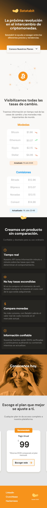
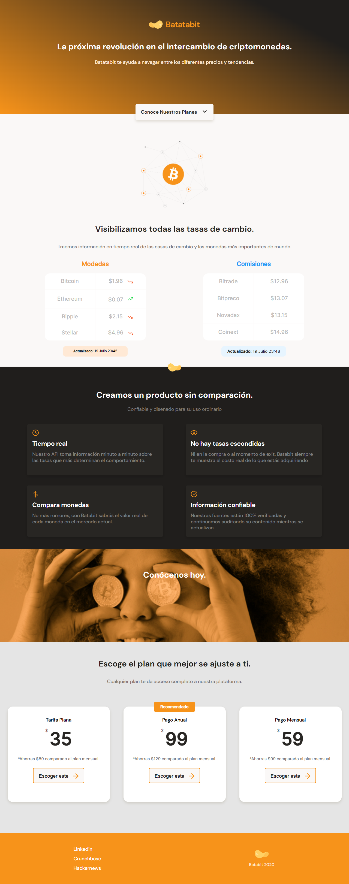

# Batata-bite  |   <a href="https://lupemorales.github.io/Harry-Potter-character-finder/" target="_blank">   Demo </a>  | 

Maquetación con HTML5 y CSS de la landing page de Batata Bit. Lo he realizado siguiendo el diseño dado a través de Figma. Se trata de un diseño responsive que permite ser visible correctamente desde cualquier dispositivo. Por otro lado lo he maquetado siguiendo la premisa mobile first.

### Web responsive mobile:

### Web responsive desktop:

## Contacto

- GitHub [@lupeMorales](https://github.com/lupeMorales )
- Linkedin [@GuadalupeMoralesCarmona](https://linkedin.com/in/guadalupe-morales-carmona-817245226/ )